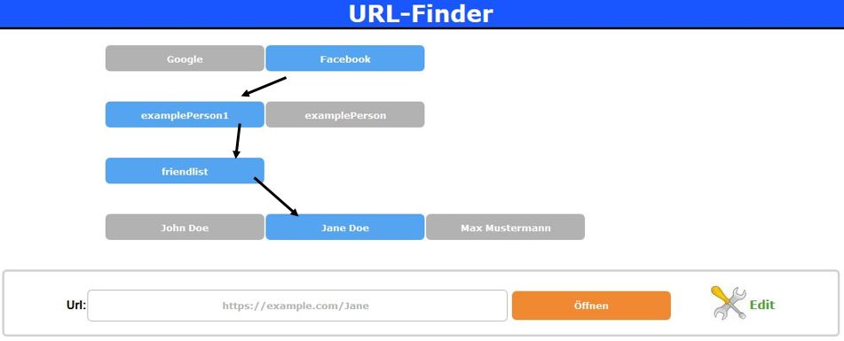
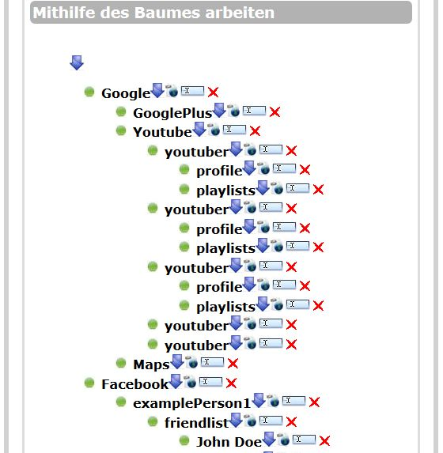

## Screenshots

## Note

This is a very old project of mine, but I still decided to make it public. It may contain unvalid HTML and Bugs. No updates are planned in the near future.

## Description

URL-Finder helps you organizing all of your URLs in a hierarchical webbrowserview. This can be very usefull when you have different stages like "Development", "Integration" and "Production" with different webapplications on it.

## Installation

* copy the php-files to your php-Apache-directory (for example htdocs in XAMPP)
* create a database called "urlfinder" by importing the example_database.sql file to your MySQL installation (you can also do this by your own and change the parameters in db_connect.php)
* open your browser and navigate to the urlfinder.php file

### Features

* Hierarchical View for all URLs
* Creating/Updating categories and URLs in a treeview

## License
  